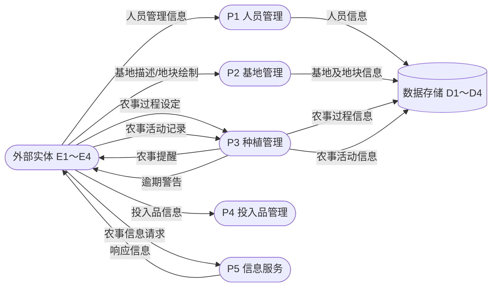
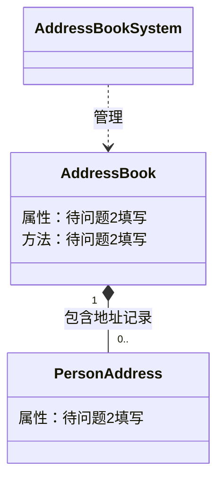

# Day 30 全真模拟 · 科目二下午卷（大题部分）—— 试题练习

> **适用**：软考中级·软件设计师 科目二（下午卷）大题全真模拟
> **日期**：Day 30｜**下午 14:00–15:30，严格计时 90 分钟，4 道大题**
> **配套**：答案 + 逐问丢分点解析见 `subject2-key.md`；考前 5 点清单见 `pre-exam-5-points.md`
> **试题来源**：全部为 2021–2023 年真实下午试卷试题，逐字转录（跨 4 套卷混合组卷）

---

## ⚠️ 使用说明（务必先读）

1. **这是闭卷模拟**。本文**不含任何答案**；做完前不要打开 `subject2-key.md`。
   手机静音、断网、备好草稿纸，按 14:00–15:30 严格计时。
2. **图形/代码说明**：原卷图 1-1/1-2（DFD）、图 2-1（E-R）、图 3-1/3-2（UML）、图 6-2（类图）
   均为 PDF 图片，本地文本源未收录图形内容。本文对每道题给出 **结构化复原**
   （实体/加工/存储清单、实体属性清单、类骨架、C 代码全文），一律标注
   **【存疑：图形复原】** 并给出源指针。复原**只给结构性数据，不给任何待填答案**。
   若手边有原卷 PDF，请对照原图做题，并在对答案时重点核对。
3. **作答要求**：
   - 试题一：问题 1/2 要求"使用说明中的词语"，答案必须从【说明】原句中提取，不要自创词汇；
     补数据流要写出"数据流名称 + 起点 + 终点"三要素。
   - 试题二：补联系必须写出"联系名（可用联系1/联系2/…代替）+ 两端实体 + 联系类型
     （1:1 / 1:n / m:n）"；关系模式填空要把属性填到对应空位；主键外键要写"主键：…，外键：…"。
   - 试题三：用例名/类名优先用【说明】中的原词（含英文括号注）。
   - 试题四：C 代码填空，语法要能与上下文编译通过；复杂度用 O 表示。
4. **考试节奏提示**（贯穿全程）：
   - **先读【说明】→ 圈关键句 → 逐问作答 → 绝不留空**。每道大题先花 3–5 分钟通读【说明】，
     把"实体名、存储动词（存储/保存/记录/维护）、量词（一个/多名/只属于）、英文括号注"圈出来，
     再看问题。问题 1/2（实体、存储、类名、属性）几乎就是把你圈的词抄到空位上。
   - 遇到卡壳的空**先跳过**，把有把握的空先填上；下午大题按点给分，
     **写出关键名词/数据流名就能拿步骤分，空着一定是 0 分**。
   - 时间分配建议：试题一 ≤ 25 分钟、试题二 ≤ 20 分钟、试题三 ≤ 20 分钟、
     试题四 ≤ 20 分钟，留 5 分钟检查补漏。

### 本次组卷（试题来源标注）

| 题号 | 试题来源 | 题型 | 考点 | 答案来源 |
|------|----------|------|------|----------|
| 试题一 | **2023 年上半年 下午试题一** | DFD | 农事管理服务平台：实体/存储/补数据流/数据流组成 | 源内嵌官方参考答案（完整） |
| 试题二 | **2022 年下半年 下午试题二** | 数据库设计（E-R + 关系模式） | 营销公司业务管理：补 3 个联系 + (a)(b) 属性 + 主键外键 + 新增实体 | ⚠️ 源中无答案，`subject2-key.md` 用【存疑：推导答案】 |
| 试题三 | **2022 年上半年 下午试题三** | UML（用例图 + 类图） | 地址簿管理系统：U1～U6 用例名 + 类属性/方法 + include/extend 含义 | 源参考答案（标注"答案不唯一"） |
| 试题四 | **2021 年上半年 下午试题四** | 算法（C 填空） | 凸多边形最优三角剖分：4 处代码填空 + 策略/时空复杂度 | 源内嵌答案（完整，代码有 OCR 损伤，已标注） |

> **组卷说明**：4 道题覆盖下午卷四类必考题型，跨 4 套卷（2023上 + 2022下 + 2022上 + 2021上）混合，
> 避免整套取自同一年的部分提取。选题优先保证"题目文本完整 + 答案存在"：
> 试题二（E-R）的候选题（2021上试题二 / 2022下试题二）在本地源中**均无内嵌答案**
> （答案页未被提取），本题按"完整性 > 覆盖均匀"原则仍选用题目文本完整的 2022下试题二，
> 答案由 `subject2-key.md` 给出**完整推导**并逐处标注【存疑：推导答案】，非官方答案。
> 详见 `subject2-key.md` 末尾"选题与弃用记录"。

---

## ⏱️ 计时记录区（模拟开始前填写开始时间，结束后填写）

| 项目 | 记录 |
|------|------|
| 模拟开始时间（建议 14:00） | ______ |
| 试题一用时 | ______ 分钟（建议 ≤ 25） |
| 试题二用时 | ______ 分钟（建议 ≤ 20） |
| 试题三用时 | ______ 分钟（建议 ≤ 20） |
| 试题四用时 | ______ 分钟（建议 ≤ 20） |
| 检查补漏用时 | ______ 分钟 |
| 总用时（目标 ≤ 90 分钟） | ______ 分钟 |
| 自评专注度（0-10） | ______ |

---

## 📊 得分汇总表（做完后对照 `subject2-key.md` 自评）

| 题号 | 试题 | 题型 | 满分 | 得分 | 主要丢分点 | 是否回看模板 |
|------|------|------|------|------|------------|--------------|
| 试题一 | 2023上·农事管理服务平台 | DFD | 15 | ____ | ________________ | ☐ |
| 试题二 | 2022下·营销公司业务管理 | E-R + 关系模式 | 15 | ____ | ________________ | ☐ |
| 试题三 | 2022上·地址簿管理系统 | UML | 15 | ____ | ________________ | ☐ |
| 试题四 | 2021上·凸多边形最优三角剖分 | 算法（C 填空） | 15 | ____ | ________________ | ☐ |
| **合计** | | | **60** | ____ | | |

> **合格线说明**：正式下午卷为 **5 道题（试题一～四必答 + 试题五/六选一），每题 15 分，
> 满分 75，合格 45 分**。本模拟为 **4 道大题、满分 60 分**，按同比例折算合格线为
> 60 × (45/75) = **36 分**。**自评目标 ≥ 36 分**（相当于正式卷 45 分）；
> 单题目标 ≥ 10 分；任何一题 < 8 分，当晚必须回看对应专项模板（见文末"复盘指北"）。

---
---

# 试题一：2023 年上半年 下午试题一（农事管理服务平台）

> **来源**：2023 年上半年 软件设计师 下午试卷 试题一（共 15 分）
> （题目与答案均取自《2023 年上半年软件设计师下午试卷 参考答案》PDF）
> **题型**：数据流图（DFD）｜**建议用时**：25 分钟

---

### 【说明】

随着农业领域科学种植的发展，需要对农业基地及农事进行信息化管理，为租户和农户等人员
提供种植相关服务。现欲开发农事管理服务平台，其主要功能是：

（1）人员管理。平台管理员管理租户；租户管理农户并为其分配负责的地块，租户和农户以
人员类型区分。

（2）基地管理。租户填写基地名称、地域等描述信息，在显示的地图上绘制地块。

（3）种植管理。租户设定作物及其从种植到采收的整个农事过程，包括农事活动及其实施计
划，农户根据相应农事过程提醒进行农事活动并记录。系统会在设定时间向农户进行农事提醒，
对逾期未实施活动向租户发出逾期警告。

（4）投入品管理。租户统一维护化肥，杀虫剂等投入品信息。农户在农事活动中设定投入品
的实际消耗。

（5）信息服务。用户按查询条件发起农事信息请求，对相关地块农事活动实施情况（如与农
事过程比对）等农事信息进行筛选、对比和统计等处理，并将响应信息进行展示。系统也给其他
第三方软件提供APP 接口，通过接口访问的方式，提供账号，密码和查询条件发起农事信息请
求，返回特定格式的农事信息，无查询条件时默返回账号下所有信息，多查询条件时返回满足全
部条件的信息。

> 【存疑：原文"无查询条件时默返回账号下所有信息"，按题意应为"默认返回账号下所有信息"】

现采用结构化方法对农事管理服务平台进行分析与设计，获得如图1-1 所示的上下文数据流
图和图1-2 所示的0 层数据流图。

---

### 图形结构化复原【存疑：图形复原】

> ⚠️ 原卷图 1-1（上下文数据流图）/图 1-2（0 层数据流图）为 PDF 图片，本地文本源未收录
> （源 PDF 第 2 页图区为空白）。以下清单依据【说明】逐句提取。**外部实体名称、数据存储
> 名称是本试题问题 1/2 的填空内容，清单中一律留空（写作 E1～E4、D1～D4），
> 请从【说明】中自行提取。**

#### 图 1-1 上下文数据流图骨架

- **中心加工**：农事管理服务平台（唯一加工）
- **外部实体**（4 个，名称待问题 1 填写）：`E1`、`E2`、`E3`、`E4`
- **系统与外部实体之间的数据流**（据【说明】逐句提取，**未对应到具体 E 编号**——
  请根据【说明】判断每条数据流连接哪个实体）：
  1. 租户/农户人员管理信息（人员类型、分配的地块等）
  2. 基地名称、地域等描述信息 / 地块绘制信息
  3. 农事过程（作物、农事活动及实施计划）设定信息
  4. 农事提醒（系统 → 农户）
  5. 逾期警告（系统 → 租户）
  6. 农事活动记录（农户进行农事活动并记录）
  7. 投入品信息（化肥、杀虫剂等，租户维护）
  8. 农事信息请求（用户 / 第三方软件发起；**具体组成见问题 4**）
  9. 响应信息 / 特定格式的农事信息（展示给用户 / 返回第三方软件）

> 💡 **判断实体归属的方法**：把上面 9 条流逐条与【说明】的 5 项功能对照——
> 功能 (1) 出现"平台管理员""租户""农户"三类人员；功能 (5) 出现"第三方软件"。
> 注意"用户"是统称（功能 5 中发起请求的"用户"涵盖上述人员），**不单独作为实体**。
> 据此锁定 E1～E4 的**名称集合**，编号与名称的对应关系以原卷图形为准。

#### 图 1-2 0 层数据流图骨架

- **加工**（5 个，名称取自【说明】的功能名）：
  `P1 人员管理`、`P2 基地管理`、`P3 种植管理`、`P4 投入品管理`、`P5 信息服务`

  > 【存疑：加工编号 P1～P5 按功能 (1)～(5) 顺序推断；参考答案中的数据流引用与该编号一致，
  > 原卷图形编号方式请以原卷为准】

- **数据存储**（4 个，名称待问题 2 填写）：`D1`、`D2`、`D3`、`D4`
- **外部实体**：`E1`、`E2`、`E3`、`E4`（同图 1-1）

> ⚠️ **关于 E/D 编号**：问题 1/2 要求把名称填到具体编号（E1～E4、D1～D4），
> 编号与名称的**对应关系只能由原卷图形给出**。若无原卷，可先确定四个实体、四个存储的
> **名称集合**，编号对应以原卷为准；问题 3 的平衡分析不依赖具体编号，可完整作答。

**已画出的数据流**（据【说明】复原，**不含问题 3 待补的数据流**；外部实体/数据存储
作聚合示意，**不暴露编号与名称的对应关系**）：



**逐加工平衡清单**（问题 3 的作答依据——逐行检查"有输入无输出 / 有输出无输入 /
输入不足以产生输出"，缺的流回【说明】找原词补上）：

| 加工 | 已画输入 | 已画输出 |
|------|----------|----------|
| P1 人员管理 | 人员管理信息（←外部实体） | 人员信息（→数据存储） |
| P2 基地管理 | 基地描述/地块绘制（←外部实体） | 基地及地块信息（→数据存储） |
| P3 种植管理 | 农事过程设定（←外部实体）、农事活动记录（←外部实体） | 农事过程信息（→数据存储）、农事活动信息（→数据存储）、农事提醒（→外部实体）、逾期警告（→外部实体） |
| P4 投入品管理 | 投入品信息（←外部实体） | （复原图中未画输出——见下方提示） |
| P5 信息服务 | 农事信息请求（←外部实体） | 响应信息（→外部实体） |

> 💡 对照【说明】逐项核对：
> - 功能 (5) 说信息服务要对"**相关地块**农事活动实施情况（如与**农事过程**比对）等
>   **农事信息**进行筛选、对比和统计"——P5 的输出是响应信息，但输入只有"请求"，
>   它**要处理的数据**（地块、农事过程、农事活动）从哪里来？逐条回【说明】找原词。
> - 功能 (4) 说投入品管理要维护投入品信息，而"农户在**农事活动中**设定投入品的实际消耗"——
>   实际消耗数据随农事活动记录进入系统，P4 要维护投入品信息时缺哪条输入？
> - 记忆口诀（见 `../subject2/dfd-uml-notes.md` 一·第 3 步）：**实时数据走"加工→加工"，
>   历史/批量数据走"存储→加工"**；【说明】中带"查询/统计/比对"字样的处理只能读存储。
>
> ⚠️ 上图为**结构化示意**，非原卷图形；完整平衡后的数据流（含问题 3 答案）
> 见 `subject2-key.md`。

---

### 【问题1】（4 分）

使用说明中的词语，给出图1-1 中的实体E1~E4 的名称。

**答题区**：

- E1：________________________
- E2：________________________
- E3：________________________
- E4：________________________

---

### 【问题2】（4 分）

使用说明中的词语，给出图1-2 中的数据存储D1~D4 的名称。

> 💡 提示：【说明】中"存储/记录/维护/设定"等动词出现在哪几个功能里，就对应几个数据存储；
> 存储名称 = 被存储对象名 + "表/信息表/记录/文件"后缀（后缀用词不影响给分，核心词必须来自【说明】）。

**答题区**：

- D1：________________________
- D2：________________________
- D3：________________________
- D4：________________________

---

### 【问题3】（4 分）

根据说明和图中术语，补充图1-2 中缺失的数据流及其起点和终点。

**答题区**：

| 数据流名称 | 起点 | 终点 |
|------------|------|------|
| ① ________________ | ________________ | ________________ |
| ② ________________ | ________________ | ________________ |
| ③ ________________ | ________________ | ________________ |
| ④ ________________ | ________________ | ________________ |

> 💡 提示：逐个加工检查"有输入无输出 / 有输出无输入 / 输入不足以产生输出"三类不平衡，
> 再回【说明】找对应的数据流名称（名称必须用【说明】原词）。先算 P5（输出明确、输入不足），
> 再算 P4。

---

### 【问题4】（3 分）

根据说明，给出"农事信息请求"数据流的组成。

> 💡 提示：数据流组成 = 该数据流携带的数据项清单。回【说明】功能 (5) 找"发起农事信息请求"
> 需要提供什么——注意"第三方软件通过接口访问"那句里明确列出的三项，普通用户与第三方
> 发起的请求组成相同。用"数据流 = 项 + 项 + 项"或"数据流：项、项、项"的格式写均可。

**答题区**：

```
农事信息请求 = ____________________________________________________
```

---
---

# 试题二：2022 年下半年 下午试题二（营销公司业务管理系统）

> **来源**：2022 年下半年 软件设计师 下午试卷 试题二（共 15 分）
> **题型**：数据库设计（E-R 图 + 关系模式）｜**建议用时**：20 分钟
> ⚠️ **本题在本地答案源中无内嵌答案**（答案页未被提取），`subject2-key.md` 中为
> 【存疑：推导答案】+ 完整推导，非官方答案。作答时按题目要求自行判定，做完重点对推导。

---

### 【说明】

某营销公司为了便于对各地的分公司及专卖店进行管理，拟开发一套业务管理系统，请
根据下述需求描述完成该系统的数据库设计。

### 【需求分析结果】

（1）分公司信息包括：分公司编号、分公司名、地址和电话。其中，分公司编号唯一
确定分公司关系的每一个元组。每个分公司拥有多家专卖店，每家专卖店只属于一个分公司。

（2）专卖店信息包括：专卖店号、专卖店名、店长、分公司编号、地址、电话，其中
店号唯一确定专卖店关系中的每一个元组。每家专卖店只有一名店长，负责专卖店的各项
业务；每名店长只负责一家专卖店：每家专卖店有多名职员，每名职员只属于一家专卖店。

> 【存疑：原文"每家专卖店只有一名店长"与后文"每名店长只负责一家专卖店"配套，
> 量词齐全；原文"店号唯一确定"应为"专卖店号唯一确定"】

（3）职员信息包括：职员号、职员名、专卖店号、岗位、电话、薪资。其中，职员号
唯一标识职员关系中的每一个元组。岗位有店长、营业员等。

### 【概念模型设计】

根据需求阶段收集的信息，设计的实体联系图（不完整）如图2-1 所示。

### 【逻辑结构设计】

根据概念模型设计阶段完成的实体联系图，得出如下关系模式（不完整）：

```
分公司（分公司编号，分公司名，地址，电话）
专卖店（专卖店号，专卖店名，  （a）  ，地址，电话）
职员（职员号，职员名，  （b）  ，岗位，电话，薪资）
```

---

### 图形结构化复原【存疑：图形复原】

> ⚠️ 原卷图 2-1（实体联系图）为 PDF 图片，本地文本源未收录。以下清单依据
> 【需求分析结果】逐句提取，**只列出题目已写明的实体与属性，以及需求中的联系线索句**；
> 待问题 1 填补的"联系本身"（哪两个实体相连、什么类型）一律留空，请自行判定。

#### 实体与属性清单（均取自【需求分析结果】原句）

| 实体 | 属性（需求原句） |
|------|------------------|
| 分公司 | 分公司编号、分公司名、地址、电话 |
| 专卖店 | 专卖店号、专卖店名、店长、分公司编号、地址、电话 |
| 职员 | 职员号、职员名、专卖店号、岗位、电话、薪资 |

#### 需求中的联系线索句（判定联系类型的依据）

> 💡 把每条线索句读两遍，圈出"一个""一名""多家""只属于"等量词，再套用
> `../subject2/database-notes.md` 二·第 2 步的判定口诀：
> **两端都唯一 → 1:1；一端唯一 → 1:n；都不唯一 → m:n**。

1. 「每个分公司拥有多家专卖店，每家专卖店只属于一个分公司」
2. 「每家专卖店有多名职员，每名职员只属于一家专卖店」
3. 「每家专卖店只有一名店长，负责专卖店的各项业务；每名店长只负责一家专卖店」

> 【存疑：图 2-1 中已画出哪些实体框、留了几个菱形（联系）空白，文本源未收录图形，
> 无法确认。问题 1 明确要求"补充 **三个**联系"，请按上述 3 条线索句逐一对应。
> 注意第 3 条的"店长"是职员的一种岗位（需求 (3)："岗位有店长、营业员等"），
> 该联系连在哪两个实体之间，是本题的判定难点。】

---

### 【问题1】（6 分）

根据需求描述，图2-1 实体联系图中缺少三个联系。请在答题纸对应的实体联系图中补
充三个联系及联系类型。

注：联系名可用联系1、联系2、联系3；也可根据你对题意的理解取联系名。

**答题区**（写出：联系名 + 两端实体 + 联系类型）：

| 联系名 | 连接的实体 | 联系类型 |
|--------|------------|----------|
| 联系1：______________ | ______ 与 ______ | ______ （1:1 / 1:n / m:n） |
| 联系2：______________ | ______ 与 ______ | ______ （1:1 / 1:n / m:n） |
| 联系3：______________ | ______ 与 ______ | ______ （1:1 / 1:n / m:n） |

> 💡 提示：三个联系分别对应三条线索句；联系名可自拟（"拥有/所属""聘用/任职"等），
> 阅卷按"两端实体 + 类型"给分。

---

### 【问题2】（6 分）

（1）将关系模式中的空  （a）  、  （b）  的属性补充完整，并填入答题纸对应的
位置上。

（2）专卖店关系的主键：  （c）  和外键：  （d）  。

职员关系的主键：  （e）  和外键：  （f）  。

**答题区**：

（1）

- （a）：________________________
- （b）：________________________

（2）

- （c）专卖店主键：________________________
- （d）专卖店外键：________________________
- （e）职员主键：________________________
- （f）职员外键：________________________

> 💡 提示：把【需求分析结果】各条列出的属性逐项与关系模式对照，缺什么补什么
> （注意专卖店有**两个**属性未出现在关系模式中）。外键 = 该关系模式中引用其它关系主键
> 的属性；判定规则见 `../subject2/database-notes.md` 二·"主键 / 外键判定规则"。

---

### 【问题3】（3 分）

（1）为了在紧急情况发生时，能及时联系到职员的家人，专卖店要求每位职员至少要
填写一位紧急联系人的姓名、与本人关系和联系电话。根据这种情况，在图2-1 中还需添加
的实体是  （g）  ，职员关系与该实体的联系类型为  （h）  。

（2）给出该实体的关系模式。

**答题区**：

（1）

- （g）新增实体：________________________
- （h）联系类型：________ （1:1 / 1:n / m:n）

（2）该实体的关系模式：

```
____________________________________________________________________
```

> 💡 提示：新增实体 = 【说明】中出现的新名词（"紧急联系人"），其属性在题干中已列出
> （姓名、与本人关系、联系电话）；关系模式中还要加上**与职员关联的外键属性**。
> 联系类型用口诀判定："每位职员**至少一位**（可多位）紧急联系人"——哪一端唯一？

---
---

# 试题三：2022 年上半年 下午试题三（地址簿管理系统）

> **来源**：2022 年上半年 软件设计师 下午试卷 试题三（共 15 分）
> **题型**：UML（用例图 + 类图）｜**建议用时**：20 分钟
> ⚠️ 本题源参考答案标注"答案不唯一"（问题 1 的 U1～U6 有多组可行组合），
> `subject2-key.md` 给出全部参考组合 + 一组带推理的推荐答案。

---

### 【说明】

某公司的人事部门拥有一个地址簿（AddressBook）管理系统（AddressBookSystem），
用于管理公司所有员工的地址记录（PersonAddress）。员工的地址记录包括：姓名、住址、
城市、省份、邮政编码以及联系电话等信息。

管理员可以完成对地址簿中地址记录的管理操作，包括：

（1）管理地址记录。根据公司的人员变动情况，对地址记录进行添加、修改、删除等
操作。

（2）排序。按照员工姓氏的字典顺序或邮政编码对地址簿中的所有记录进行排序。

（3）打印地址记录。以邮件标签的格式打印一个地址单独的地址簿。

> 【存疑：原文"以邮件标签的格式打印一个地址单独的地址簿"语句不通，按题意应为
> "以邮件标签的格式单独打印地址簿中的地址记录"】

系统会对地址记录进行管理，为便于管理，管理员在系统中为公司的不同部门建立员工
的地址簿的操作，包括：

（1）创建地址簿。新建一个地址簿并保存。

（2）打开地址簿。打开一个已有的地址簿。

（3）修改地址簿。对打开的地址簿进行修改并保存。

> 【存疑：以上三句的"地址簿"指按部门建立的地址簿；"修改地址簿。对打开的地址簿进行
> 修改并保存"隐含"修改前必须先打开"这一前置条件——是问题 1 判定 include/extend
> 的关键线索】

系统将提供一个GUI（图形用户界面）实现对地址簿的各种操作。

现采用面向对象方法分析并设计该地址簿管理系统，得到如图3-1 所示的用例图以及图
3-2 所示的类图。

---

### 图形结构化复原【存疑：图形复原】

> ⚠️ 原卷图 3-1（用例图）/图 3-2（类图）为 PDF 图片，本地文本源未收录
> （源 PDF 第 10 页图区为空白）。以下骨架依据【说明】复原。**U1～U6 用例名、
> 类的属性/方法是本试题填空内容，一律留空。**

#### 图 3-1 用例图骨架

- **参与者**：管理员（图中已给出，非填空内容）
- **用例**（图中共 6 个待填空用例框）：`U1`、`U2`、`U3`、`U4`、`U5`、`U6`
- **用例候选词**（据【说明】逐句提取，自行判断哪些填入 U1～U6、哪些已在图中标明）：
  - 管理地址记录（添加地址记录 / 修改地址记录 / 删除地址记录）
  - 按照员工姓氏的字典顺序排序
  - 按邮政编码排序
  - 打印地址记录
  - 创建地址簿
  - 打开地址簿
  - 修改地址簿
  - 保存地址簿
  - GUI（图形用户界面）
- **用例之间的关系**：图中用例之间存在 `<<include>>` / `<<extend>>` 虚线关系
  （哪些用例之间连、是哪种关系，以原卷图形为准——是问题 1 答案不唯一的根源）

> 💡 **判断 U1～U6 归属的方法**：把【说明】中的动作短语与图中 6 个空位逐一比对——
> "排序"有两种方式（两种排序各占一个用例）；"地址簿操作"有创建/打开/修改三种，
> 且创建与修改都伴随"保存"这一公共行为。据此可锁定 U1～U6 的**候选集合**。
>
> 💡 **判断 include/extend 的方法**（问题 3 的采分点）：若"用例 X 执行时**必然**执行
> 用例 Y"（Y 是 X 的必需步骤/被抽取的公共行为），则为 `<<include>>`；若"用例 Y 只在
> **特定条件/可选分支**下才执行，扩展 X 的行为"，则为 `<<extend>>`。
>
> 【存疑：U1～U6 与图中用例框的一一对应关系、各关系连线的两端，文本源未收录图形，
> 无法确认；源参考答案明确标注"答案不唯一，大家参考后自行判断"。】

#### 图 3-2 类图骨架



- **已给类名**（图中直接标出，非填空）：`AddressBookSystem`（地址簿管理系统）、
  `AddressBook`（地址簿）、`PersonAddress`（地址记录）
- **待填内容**（问题 2）：`AddressBook` 的主要属性 + 方法，`PersonAddress` 的主要属性
- **结构线索**：一个 `AddressBook`（按部门建立）包含 0..n 条 `PersonAddress`；
  `AddressBookSystem` 通过 GUI 对 `AddressBook` 进行各种操作

> 💡 提示：`PersonAddress` 的属性几乎就是【说明】第一段"员工的地址记录包括……"的原句；
> `AddressBook` 是"按部门建立"的地址簿，其属性 = 地址记录属性 + **部门信息**，
> 其方法 = 【说明】中管理员对地址簿/地址记录的全部操作动词。详见
> `../subject2/dfd-uml-notes.md` 二·"类图填空三招"（名词找类、动词找方法）。

---

### 【问题1】（6 分）

根据说明中的描述，给出图3-1 中U1〜U6 所对应的用例名。

**答题区**：

- U1：________________________
- U2：________________________
- U3：________________________
- U4：________________________
- U5：________________________
- U6：________________________

> 💡 提示：用例名必须用【说明】原句中的动词短语（如"按照员工姓氏的字典顺序排序"）。
> U1/U2 对应两种排序；U3～U6 对应地址簿操作及公共行为，顺序随图中连线而定，
> 本题源答案明确"答案不唯一"，填出合理组合即可。

---

### 【问题2】（5 分）

根据说明中的描述，给出图3-2 中类AddressBook 的主要属性和方法以及类
PersonAddress 的主要属性（可以使用说明中的文字）

**答题区**：

- AddressBook 的主要属性：____________________________________________________

______________________________________________________________________________

- AddressBook 的方法：________________________________________________________

______________________________________________________________________________

- PersonAddress 的主要属性：__________________________________________________

______________________________________________________________________________

---

### 【问题3】（4 分）

根据说明中的描述以及图3-1 所示的用例图，请简要说明include 和extend 关系的含义是什么？

**答题区**：

- include（包含关系）：________________________________________________________

______________________________________________________________________________

______________________________________________________________________________

- extend（扩展关系）：__________________________________________________________

______________________________________________________________________________

______________________________________________________________________________

> 💡 提示：见 `../subject2/dfd-uml-notes.md` 二·"用例图三关系"。答题时先写标准定义，
> 再各举一个本系统的例子（如"创建地址簿"与"保存地址簿"是什么关系？为什么？），
> 定义 + 例子双采分点。

---
---

# 试题四：2021 年上半年 下午试题四（凸多边形最优三角剖分）

> **来源**：2021 年上半年 软件设计师 下午试卷 试题四（共 15 分）
> **题型**：算法（C 代码填空）｜**建议用时**：20 分钟
> ⚠️ C 代码在源 PDF 提取时有若干 OCR 损伤（非填空行），已逐处标注【存疑：OCR】；
> 填空 (1)～(4) 与问题 2 的 (5)～(7) 均完整。作答时按"语法能编译 + 与题干递归式一致"作答。

---

### 【说明】

凸多边形是指多边形的任意两点的连线均落在多边形的边界或内部。相邻的点连线落在
多边形边界上，称为边；不相邻的点连线落在多边形内部，称为弦。假设任意两点连线上均
有权重，凸多边形最优三角剖分问题定义为：求将凸多边形划分为不相交的三角形集合，且
各三角形权重之和最小的剖分方案。每个三角形的权重为三条边权重之和。

假设N 个点的凸多边形点编号为V1, V2, ...... , VN,若在Vk 处将原凸多边形划分为一
个三角形V1VkVN，两个子多边形V1, V2, ... , Vk 和Vk, Vk+1, ... , VN 得到一个最优的
剖分方案，则该最优剖分方案应该包含这两个子凸边形的最优剖分方案。用m[i][j]表示Vi-1,
Vi, ... ,Vj 构成的凸多边形的最优剖分方案的权重，S[i][j]记录剖分该凸多边形的k 值。
则：

```
              { 0,                                  i ≥ j
m[i][j] =     {
              { min  { m[i][k] + m[k+1][j] + W(Vi-1 Vk Vj) },   i < j
              { i≤k<j
```

其中：W(Vi-1VkVj) = Wi-1,k + Wk,j + Wj,i-1 为三角形Vi-1VkVj 的权重，Wi-1,k,
Wk,j, Wj,i-1 分别为该三角形三条边的权重。求解凸多边形的最优剖分方案，即求解最小剖
分的权重及对应的三角形集。

> 【存疑：原文"两个子凸边形"应为"两个子凸多边形"】

---

### 【C 代码】

```c
#include<stdio.h>
#define N 6 // 凸多边形规模
int m[N + 1][N + 1]; // m[i][j]表示多边形Vi-1 到Vj 最优三角剖分的权值
int S[N + 1][N + 1]; // S[i][j]记录多边形Vi-1 到Vj 最优三角剖分的k 值
int W[N + 1][N + 1]; // 凸多边形的权重矩阵，在main 函数中输入

/* 三角形的权重a, b, c, 三角形的顶点下标 */
int get_triangle_weight(int a, int b, int c) {
    return W[a][b] + W[b][c] + W[c][a];
}

/* 求解最优值 */
void triangle_partition() {
    int i, r, k, j;
    int temp;
    /* 初始化 */
    for (i = 1; i <= N; i ++ ) {
        m[i][i] = 0;
    }
    /* 自底向上计算m, S */
    for (r = 2;   (1)  ; r ++ ) { /* r 为子问题规模 */
        for (i = 1; i <= N - r + 1; i ++ ) {
            (2)  ;
            m[i][j] = m[i][i] + m[i + 1][j] +
                get_triangle_weight(i - 1, i, j); /* k = i */
            S[i][j] = i;
            for (k = i + 1; k < j; k ++ ) { /*计算m[i][j]的最小代价 */
                temp = m[i][k] + m[k + 1][j] +
                    get_triangle_weight(i - 1, k, j);
                if (  (3)  ) { /* 判断是否最小值 */
                    m[i][j] = temp;
                    S[i][j] = k;
                }
            }
        }
    }
}

/* 输出剖分的三角形i, j：凸多边形的起始点下标 */
void print_triangle(int i, int j) {
    if (i == j) return;
    print_triangle(i, S[i][j]);
    print_triangle(  (4)  );
    printf("V%d--V%d--V%d\n", i - 1, S[i][j], j);
}
```

> ⚠️ **【存疑：OCR】源 PDF 提取的代码非填空行存在以下损伤，已按题干递归式还原为
> 可读形式（还原依据见 `subject2-key.md`），若手边有原卷请对照**：
> - 内层循环条件原文误作 `k <= N - r + 1`（循环变量为 i），按语境应为 `i <= N - r + 1`；
> - 初始权值行原文误作 `m[i][j] + m[i+1][j]` 且注释为 `/* k = j */`，按 k=i 的初始情形
>   应为 `m[i][i] + m[i+1][j]`、注释 `/* k = i */`；
> - 内层 k 循环原文误作 `k = j + 1; k < j`（恒不成立、循环体不执行），按题干
>   `i≤k<j` 应为 `k = i + 1; k < j`；
> - `get_triangle_weight` 原文两处误作 `ge_triangle_ weight`；`print_triangle` 形参
>   原文误作 `nt j`。
>
> 💡 **做题方法**：先不要被非填空行干扰——填空 (1)～(4) 只需让程序"语法通 + 与题干递归式
> 逐项对齐"。参照 `../subject2/patterns-algo-notes.md` 二·2.1 填空四步法与 2.2 DP 状态转移三件套。

---

### 【问题1】（8 分）

根据题干说明，填充C 代码中的空（1）〜（4）。

**答题区**：

- （1）：________________________
- （2）：________________________
- （3）：________________________
- （4）：________________________

---

### 【问题2】（7 分）

根据题干说明和C 代码，该算法采用的设计策略为  （5）  。

算法的时间复杂度为  （6）  ，空间复杂度为  （7）  （用O 表示）

**答题区**：

- （5）：________________________
- （6）：________________________
- （7）：________________________

> 💡 提示：(5) 看题干"最优剖分包含子凸多边形的最优剖分"——最优子结构 + 重叠子问题
> 对应哪类策略？(6) 看三重循环（r / i / k）的嵌套层数；(7) 看两个 N×N 数组。

---
---

## 📝 做完后：自评与对答案（复盘指北）

1. 填写上方计时记录区与得分汇总表，计算总用时：______ 分钟（目标 ≤ 90 分钟）。
2. 打开 `subject2-key.md`，逐题对答案，每题计算得分 /15：
   - 试题一/试题四：逐空给分，对照"丢分点解析"回填错因。
   - 试题二：答案为推导所得（【存疑：推导答案】），重点核对**推导过程**而非结论。
   - 试题三：问题 1 答案不唯一，核对自己的组合是否在参考组合内。
3. **得分 < 8 分的题**，当晚（Step 4）必须回看对应专项模板：
   - 试题一 DFD → `../subject2/dfd-uml-notes.md` 一·DFD 答题模板（第 3 步数据流平衡）
   - 试题二 E-R → `../subject2/database-notes.md` 二·E-R 图答题模板（第 2 步联系类型
     判定口诀 + 第 4 步 E-R → 关系模式转换规则）
   - 试题三 UML → `../subject2/dfd-uml-notes.md` 二·UML 答题模板（类图填空三招 +
     用例图三关系）
   - 试题四 算法 → `../subject2/patterns-algo-notes.md` 二·算法填空答题策略
     （2.1 填空四步法 + 2.2 DP 状态转移三件套）
4. 模拟复盘后，把"考前必须再看的 5 个点"填入 `pre-exam-5-points.md`
   （失分点优先；若没有更个性化的发现，直接用该文件的"默认版 5 点"）。
