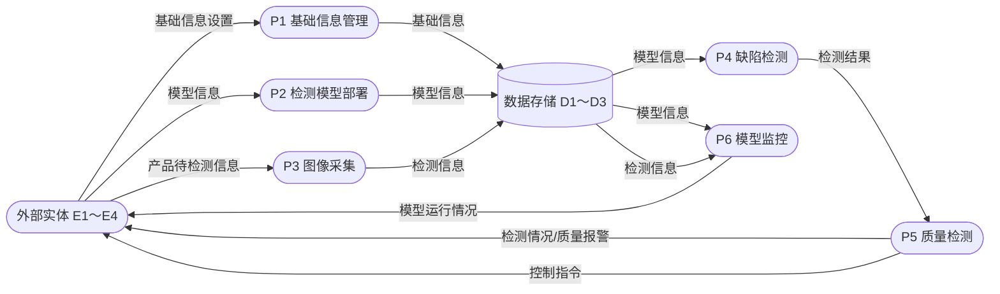
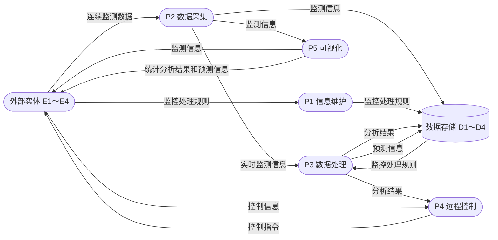
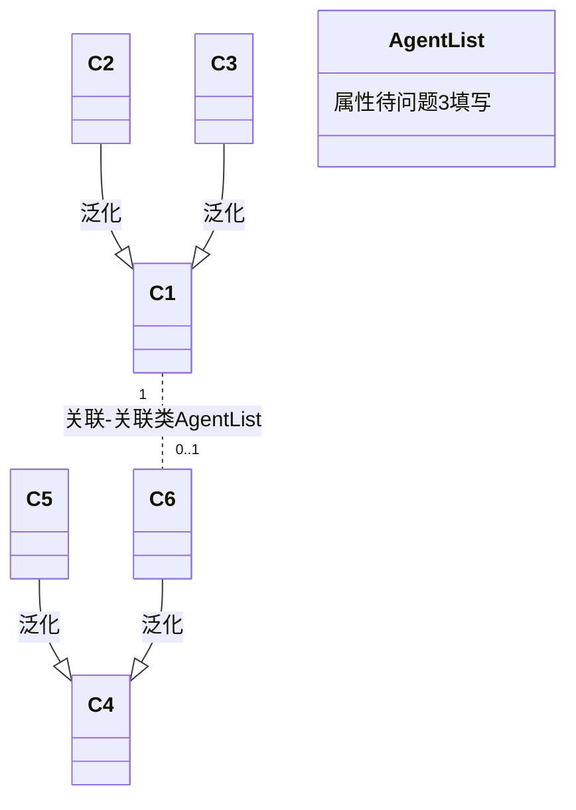
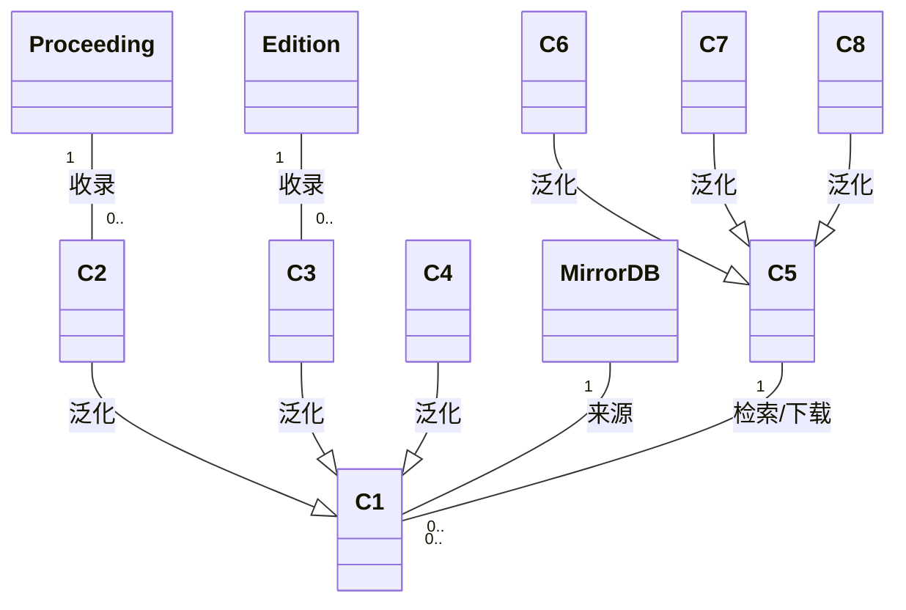

# Day 27 大题专项①：数据流图（DFD）+ UML —— 试题练习

> **适用**：软考中级·软件设计师 科目二（下午卷）试题一（DFD）与试题三（UML）专项
> **日期**：Day 27｜**上午 3h 做题**｜共 4 道大题（DFD×2 + UML×2），每题 15 分
> **配套**：答案与丢分点解析见 `dfd-uml-key.md`；答题模板见 `dfd-uml-notes.md`
> **试题来源**：全部为 2020–2023 年下半年/上半年真实下午试卷试题，逐字转录

---

## ⚠️ 使用说明（务必先读）

1. **先做题，后对答案**。本文不含任何答案；做完前不要打开 `dfd-uml-key.md`。
2. **图形题说明**：原卷图形为 PDF 图片，本地文本源未收录图形内容。本文对每道题给出
   **结构化复原**（加工/数据流/外部实体/数据存储清单，或类图的类框/关系骨架），
   一律标注 **【存疑：图形复原】**。复原依据是【说明】逐句提取 + 与官方答案数据流名称交叉核对，
   **加工编号 P1～P6、"已画出/缺失"的连线划分均为推断**，与原卷图形可能在细节上存在差异。
   若手边有原卷 PDF，请对照原图做题，并在对答案时重点核对。
3. **作答要求**：问题 1/2 类题目要求"使用说明中的词语/语句"，答案必须从【说明】原句中提取，
   不要自创词汇；补数据流题要写出"数据流名称 + 起点 + 终点"三要素。
4. **计时**：试题一（DFD）建议 40 分钟/题，试题三（UML）建议 35 分钟/题；4 题合计约 2.5–3 小时。
   做完逐题填写计时记录区，再统一对答案。

### 本次选题（替换说明）

| 题号 | 试题来源 | 类型 | 考点 |
|------|----------|------|------|
| 试题 A | 2020 年下半年 下午试题一 | DFD | 智能检测系统：实体/存储/补数据流/加工逻辑描述 |
| 试题 B | 2021 年下半年 下午试题一 | DFD | 智慧农业平台：实体/存储/补数据流/加工分解与三错误 |
| 试题 C | 2020 年下半年 下午试题三 | UML | 房产信息管理系统：用例图参与者/用例/include/extend + 类图类名 + 关联类属性 |
| 试题 D | 2023 年上半年 下午试题三 | UML | 数字图书馆：类图类名/关键属性 + 设计模式结合 |

> 【存疑：选题调整】计划中拟选"2021 下半年试题三（吃金币游戏）"，但本地答案文本源中该题
> 的"问题与答案"页（试卷第 9 页）未被提取（整页空白），无法逐字转录题目与答案，故改选
> 内容完整、考点对口的 **2020 下半年试题三（房产信息管理系统）** 与 **2023 上半年试题三（数字图书馆）**。

---

# 试题 A：2020 年下半年 下午试题一（智能检测系统）

> **来源**：2020 年下半年 软件设计师 下午试卷 试题一（共 15 分）
> **题型**：数据流图（DFD）｜**建议用时**：40 分钟

## ⏱️ 计时记录（做完后填写）

| 项目 | 记录 |
|------|------|
| 开始时间 | ______ |
| 结束时间 | ______ |
| 实际用时 | ______ 分钟（建议 ≤ 40 分钟） |
| 自评专注度（0-10） | ______ |

---

### 【说明】

某工厂制造企业开发了智能检测系统以有效提升检测效率，节约人力资源，该系统的主要功能包括：

（1）基础信息管理。管理员对检测标准和监控规则等基础信息设置。

（2）检测模型部署。管理员对常用机器学习方法建立检测模型分布。

> 【存疑：原文"建立检测模型分布"，按题意应为"建立检测模型并部署"】

（3）图像采集。实时将检测多样的产品待检测建分存储，包括产品结构，生产时间，图像信号和产品图像。

> 【存疑：原文"实时将检测多样的产品待检测建分存储"语句不通，按题意应为"实时将检测的多样产品的待检测信息进行存储"】

（4）缺陷检测。根据检测模型和检测质量标准对图像采集所收到的产品检测信息中所有图像进行检测或所有图像检测合格。若一个产品出现一张图像检测不合格，就表示该产品不合格，对不合格产品，其检测结果包括，产品型号和不合格类型。

（5）质量检测。根据监控规则对产品质量进行监控，将检测情况展示给检测业务员，若不满足条件，向检测业务员发送质量报警，检测是质量发起远程控制部分，向检测设备发送控制指令进行处理。

> 【存疑：原文"检测是质量发起远程控制部分"语句不通，按题意应为"检测业务员可发起远程控制"】

（6）模型监控。在系统中部署的模型、产品的检测信息结合基础信 息进行监测分析，将模型运行情况发给监控人员。

> 【存疑：原文"基础信 息"应为"基础信息"，系源文本断字】

现采用结构化方法对智能检测系统，进行分析与设计，获得如图1-1 的上下文数据流图和图1-2 的数据流图。

---

### 图形结构化复原【存疑：图形复原】

> ⚠️ 原卷图 1-1/图 1-2 为 PDF 图片，本地文本源未收录。以下清单依据【说明】逐句提取，
> 加工编号、连线为推断，与原卷图形可能在细节上存在差异。**外部实体名称、数据存储名称
> 是本试题的填空内容，故下列清单中一律留空（写作 E1～E4、D1～D3），请从【说明】中自行提取。**

#### 图 1-1 上下文数据流图骨架

- **中心加工**：智能检测系统（唯一加工，方框/圆圈表示）
- **外部实体**（4 个，名称待问题 1 填写）：`E1`、`E2`、`E3`、`E4`
- **系统与外部实体之间的数据流**（据【说明】逐句提取，**未对应到具体 E 编号**——
  请根据【说明】判断每条数据流连接哪个实体）：
  1. 基础信息设置（含检测标准、监控规则等）
  2. 模型信息（机器学习方法 / 检测模型）
  3. 产品待检测信息（产品结构、生产时间、图像信号、产品图像）
  4. 检测情况 / 质量报警
  5. 远程控制命令
  6. 控制指令
  7. 模型运行情况

> 💡 **判断实体归属的方法**：以上 7 条流中，"基础信息设置""模型信息"只能流向**管理系统的人员**；
> "产品待检测信息""控制指令"分别进出**检测设备**；"检测情况/质量报警""远程控制命令"对接
> **检测业务员**；"模型运行情况"发给**监控人员**。逐一与【说明】的 6 项功能对照即可锁定 E1～E4。

#### 图 1-2 数据流图骨架（0 层）

- **加工**（6 个，名称取自【说明】的功能名）：
  `P1 基础信息管理`、`P2 检测模型部署`、`P3 图像采集`、`P4 缺陷检测`、`P5 质量检测`、`P6 模型监控`

  > 【存疑：加工编号 P1～P6 按功能 (1)～(6) 顺序推断，原卷图形编号方式请以原卷为准】

- **数据存储**（3 个，名称待问题 2 填写）：`D1`、`D2`、`D3`
- **外部实体**：`E1`、`E2`、`E3`、`E4`（同图 1-1）

> ⚠️ **关于 E/D 编号**：问题 1/2 要求把名称填到具体编号（E1～E4、D1～D3），
> 编号与名称的**对应关系只能由原卷图形给出**。若无原卷，可先确定四个实体、三个存储的
> **名称集合**，编号对应以原卷为准；问题 3 的平衡分析不依赖具体编号，可完整作答。

**已画出的数据流**（据【说明】复原，**不含问题 3 待补的数据流**；外部实体/数据存储
作聚合示意，**不暴露编号与名称的对应关系**）：



**逐加工平衡清单**（问题 3 的作答依据——逐行检查"有输入无输出 / 有输出无输入 /
输入不足以产生输出"，缺的流回【说明】找原词补上）：

| 加工 | 已画输入 | 已画输出 |
|------|----------|----------|
| P1 基础信息管理 | 基础信息设置（←外部实体） | 基础信息（→数据存储） |
| P2 检测模型部署 | 模型信息（←外部实体） | 模型信息（→数据存储） |
| P3 图像采集 | 产品待检测信息（←外部实体） | 检测信息（→数据存储） |
| P4 缺陷检测 | 模型信息（←数据存储） | 检测结果（→P5） |
| P5 质量检测 | 检测结果（←P4） | 检测情况/质量报警（→外部实体）、控制指令（→外部实体） |
| P6 模型监控 | 模型信息（←数据存储）、检测信息（←数据存储） | 模型运行情况（→外部实体） |

> 💡 对照【说明】逐项核对：功能 (4) 说缺陷检测要处理"图像采集所收到的产品检测信息"，
> 清单中 P4 却没有这条输入（只有模型信息）；功能 (5) 说质量检测"根据监控规则……监控"、
> 且"检测业务员发起远程控制"，清单中 P5 只有检测结果这一条输入，缺规则与命令两条；
> 功能 (6) 说模型监控要"结合基础信息"，清单中 P6 缺这一条。——这些就是问题 3 要补的流。
>
> ⚠️ 上图为**结构化示意**，非原卷图形；完整平衡后的数据流（含问题 3 答案）见 `dfd-uml-key.md`。

---

### 【问题1】（4 分）

使用说明中的语句给出图1-1 中的实体E1〜E4 的名称。

**答题区**：

- E1：________________________
- E2：________________________
- E3：________________________
- E4：________________________

---

### 【问题2】（3 分）

使用说明中的语句给出图1-2 中的数据存储D1〜D3 的名称。

**答题区**：

- D1：________________________
- D2：________________________
- D3：________________________

---

### 【问题3】（5 分）

根据说明和图中术语，补齐图1-2 中缺失的数据及起点和终点。

> 【存疑：原文"缺失的数据"，按题意应为"缺失的数据流"】

**答题区**（补齐数据流名称、起点、终点）：

| 数据流名称 | 起点 | 终点 |
|------------|------|------|
| ① ________________ | ________________ | ________________ |
| ② ________________ | ________________ | ________________ |
| ③ ________________ | ________________ | ________________ |
| ④ ________________ | ________________ | ________________ |

> 💡 提示：逐个加工检查"有输入无输出 / 有输出无输入 / 输入不足以产生输出"三类不平衡，
> 再回【说明】找对应的数据流名称（名称必须用【说明】原词）。

---

### 【问题4】（3 分）

根据说明，采用结构化语言对缺陷检测的加工逻辑进行描述。

**答题区**：

```
____________________________________________________________________
____________________________________________________________________
____________________________________________________________________
____________________________________________________________________
____________________________________________________________________
____________________________________________________________________
```

> 💡 提示：结构化语言 = 顺序结构 + IF/THEN/ELSE/ENDIF 选择结构 + DO/WHILE 循环结构。
> 从【说明】功能 (4) 逐句翻译：接收什么输入 → 做什么检测 → 什么情况判不合格 → 不合格结果包含什么。

---
---

# 试题 B：2021 年下半年 下午试题一（智慧农业平台）

> **来源**：2021 年下半年 软件设计师 下午试卷 试题一（共 15 分）
> **题型**：数据流图（DFD）｜**建议用时**：40 分钟

## ⏱️ 计时记录（做完后填写）

| 项目 | 记录 |
|------|------|
| 开始时间 | ______ |
| 结束时间 | ______ |
| 实际用时 | ______ 分钟（建议 ≤ 40 分钟） |
| 自评专注度（0-10） | ______ |

---

### 【说明】

某现代农业种植基地为进一步提升农作物种植过程的智能化，欲开发智慧农业平台，集
管理和销售于一体，该平台的主要功能有:

（1）信息维护。农业专家对农作物、环境等监测数据的监控处理规则进行维护。

（2）数据采集。获取传感器上传的农作物长势、土壤墒情、气候等连续监测数据，解
析后将监测信息进行数据处理、可视化和存储等操作。

（3）数据处理。对实时监测信息根据监控处理规则进行监测分析，将分析结果进行可
视化并进行存储、远程控制，对历史监测信息进行综合统计和预测，将预测信息进行可视化
和存储。

（4）远程控制。根据监控处理规则对分析结果进行判定，依据判定结果自动对控制器
进行远程控制。平台也可以根据农业人员提供的控制信息对控制器进行远程控制。

（5）可视化。实时向农业人员展示监测信息：实时给农业专家展示统计分析结果和预
测信息或根据农业专家请求进行展示。

现采用结构化方法对智慧农业平台进行分析与设计，获得如图1-1 所示的上下文数据流
图和图1-2 所示的0 层数据流图。

---

### 图形结构化复原【存疑：图形复原】

> ⚠️ 原卷图 1-1/图 1-2 为 PDF 图片，本地文本源未收录。以下清单依据【说明】逐句提取，
> 加工编号、连线为推断。**外部实体名称、数据存储名称是本试题填空内容，清单中一律留空。**

#### 图 1-1 上下文数据流图骨架

- **中心加工**：智慧农业平台
- **外部实体**（4 个，名称待问题 1 填写）：`E1`、`E2`、`E3`、`E4`
- **系统与外部实体之间的数据流**（据【说明】逐句提取，**未对应到具体 E 编号**）：
  1. 监控处理规则（维护/更新）
  2. 连续监测数据（农作物长势、土壤墒情、气候等）
  3. 控制信息
  4. 控制指令
  5. 监测信息（实时展示）
  6. 统计分析结果和预测信息（实时展示）
  7. 请求（按需展示）

> 💡 判断实体归属：传"监控处理规则"的是**农业专家**；上传"连续监测数据"的是**传感器**；
> 发"控制信息"、收"监测信息"展示的是**农业人员**；收"控制指令"的是**控制器**；
> 发"请求"、收"统计分析结果和预测信息"的是**农业专家**。

#### 图 1-2 0 层数据流图骨架

- **加工**（5 个，名称取自【说明】的功能名）：
  `P1 信息维护`、`P2 数据采集`、`P3 数据处理`、`P4 远程控制`、`P5 可视化`

  > 【存疑：加工编号 P1～P5 按功能 (1)～(5) 顺序推断，原卷图形编号方式请以原卷为准】

- **数据存储**（4 个，名称待问题 2 填写）：`D1`、`D2`、`D3`、`D4`
- **外部实体**：`E1`、`E2`、`E3`、`E4`（同图 1-1）

> ⚠️ **关于 E/D 编号**：问题 1/2 的编号与名称对应关系只能由原卷图形给出。若无原卷，
> 可先确定四个实体、四个存储的**名称集合**，编号对应以原卷为准；问题 3 的平衡分析
> 不依赖具体编号，可完整作答。

**已画出的数据流**（据【说明】复原，**不含问题 3 待补的数据流**；外部实体/数据存储
作聚合示意，**不暴露编号与名称的对应关系**）：



**逐加工平衡清单**（问题 3 的作答依据）：

| 加工 | 已画输入 | 已画输出 |
|------|----------|----------|
| P1 信息维护 | 监控处理规则（←外部实体） | 监控处理规则（→数据存储） |
| P2 数据采集 | 连续监测数据（←外部实体） | 实时监测信息（→P3）、监测信息（→P5）、监测信息（→数据存储） |
| P3 数据处理 | 实时监测信息（←P2）、监控处理规则（←数据存储） | 分析结果（→数据存储）、预测信息（→数据存储）、分析结果（→P4） |
| P4 远程控制 | 分析结果（←P3）、控制信息（←外部实体） | 控制指令（→外部实体） |
| P5 可视化 | 监测信息（←P2） | 监测信息（→外部实体）、统计分析结果和预测信息（→外部实体） |

> 💡 对照【说明】逐项核对：功能 (3) 说数据处理要"将分析结果进行可视化""将预测信息进行可视化"
> ——可视化是 P5 的职责，故 P3 还缺两条到 P5 的输出；功能 (3) 还说"对**历史**监测信息进行
> 综合统计和预测"，P3 的输入里只有"实时"监测信息，缺一条来自**数据存储**的历史监测信息；
> 功能 (4) 说远程控制"**根据监控处理规则**对分析结果进行判定"，P4 缺这条来自数据存储的输入；
> 功能 (5) 说"或根据农业专家**请求**进行展示"，P5 缺一条来自农业专家的请求输入。
>
> ⚠️ 注意区分：**实时数据走"加工→加工"，历史/批量数据走"存储→加工"**；
> 同名数据流（如"监控处理规则"）被多个加工读取时，每条都要单独画。
>
> ⚠️ 上图为**结构化示意**，非原卷图形；完整平衡后的数据流（含问题 3 答案）见 `dfd-uml-key.md`。

---

### 【问题1】（4 分）

使用说明中的词语，给出图1-1 中的实体E1〜E4 的名称。

**答题区**：

- E1：________________________
- E2：________________________
- E3：________________________
- E4：________________________

---

### 【问题2】（4 分）

使用说明中的词语，给出图1-2 中的数据存储D1〜D4 的名称。

**答题区**：

- D1：________________________
- D2：________________________
- D3：________________________
- D4：________________________

> 💡 提示：【说明】中"存储"一词出现在哪几个功能里，就对应几个数据存储；
> 存储名称 = 被存储对象名 + "表/信息表/文件"后缀。

---

### 【问题3】（4 分）

根据说明和图中术语，补充图1-2 中缺失的数据流及其起点和终点。

**答题区**：

| 数据流名称 | 起点 | 终点 |
|------------|------|------|
| ① ________________ | ________________ | ________________ |
| ② ________________ | ________________ | ________________ |
| ③ ________________ | ________________ | ________________ |
| ④ ________________ | ________________ | ________________ |
| ⑤ ________________ | ________________ | ________________ |

> 💡 提示：注意区分"实时数据流（加工→加工）"与"读取历史数据（存储→加工）"——
> 【说明】中带"历史"字样的输入只能来自数据存储，不能从采集加工直接来。

---

### 【问题4】（3 分）

根据说明，"数据处理"可以分解为哪些子加工？进一步进行分解时，需要注意哪三种常见的错误？

**答题区**：

**（1）子加工（据【说明】功能 (3) 的动词短语切分）**：

1. ____________________________________________________________________
2. ____________________________________________________________________
3. ____________________________________________________________________
4. ____________________________________________________________________

**（2）分解时需要注意的三种常见错误**：

1. ____________________________________________________________________
2. ____________________________________________________________________
3. ____________________________________________________________________

---
---

# 试题 C：2020 年下半年 下午试题三（房产信息管理系统）

> **来源**：2020 年下半年 软件设计师 下午试卷 试题三（共 15 分）
> **题型**：UML（用例图 + 类图）｜**建议用时**：35 分钟

## ⏱️ 计时记录（做完后填写）

| 项目 | 记录 |
|------|------|
| 开始时间 | ______ |
| 结束时间 | ______ |
| 实际用时 | ______ 分钟（建议 ≤ 35 分钟） |
| 自评专注度（0-10） | ______ |

---

### 【说明】

某房产公司欲开发一个房产信息管理系统，其主要功能描述如下：

（1）公司销售的房产（Property）分为住宅（House）和公寓（Cando）两类。针对每
套房产，系统存储房产证明、地址、建造年份、建筑面积，销售报价、房产照片以及销售状
态（在售，售出，停售）等信息。对于住宅，还需存储楼层、公摊面积、是否有地下室等信
息；对于公寓，还需存储是否有阳台等信息。

（2）公司雇佣了多名房产经纪（Agent），负责销售房产，系统中需要存储房产经纪的
基本信息，包括：姓名、家庭住址、联系电话、受雇的起止时间等。一套房产同一时段仅由
一名房产经纪负责销售，系统中会记录房产经纪负责每套房产的起始时间和终止时间。

（3）系统用户（User）包括房产经纪和系统管理员（Manager），用户需经过系统身份
验证之后才能登录系统。房产经纪登录系统之后，可以录入负责销售的房产信息，也可以查
询所负责的房产信息。房产经纪可以修改其负责的房产信息，但需要经过系统管理员的审批
授权。

（4）系统管理员可以从系统中导出所有房产的信息列表，系统管理员定期将售出和停
售的房产信息进行归档，若公司确定不再销售某套房产，系统管理员将该房产信息从系统中
删除。

现采用面向对象方法开发该系统，得到如图3-1 所示的用例图和图3-2 所示的初始类图。

---

### 图形结构化复原【存疑：图形复原】

> ⚠️ 原卷图 3-1（用例图）/图 3-2（初始类图）为 PDF 图片，本地文本源未收录。
> 以下骨架依据【说明】复原。**参与者名称、用例名称、类名是本试题填空内容，一律留空。**

#### 图 3-1 用例图骨架

- **参与者**（2 个，名称待问题 1 填写）：`A1`、`A2`
  > 【说明】中只出现两类"人"：房产经纪、系统管理员（系统用户 User 是它们的统称，不单独画参与者）

- **用例**（图中出现的用例框，其中 `U1`、`U2`、`U3` 名称待问题 1 填写）：
  - 身份验证（登录）
  - 录入房产信息
  - 查询所负责的房产信息
  - 导出房产信息列表
  - 归档（售出和停售的房产信息）
  - `U1`、`U2`、`U3`

- **用例之间的关系**：图中用例之间存在两条带箭头的虚线关系，分别标注 `（a）`、`（b）`，
  关系类型待问题 1 第 (2) 问填写（`<<include>>` 或 `<<extend>>`）。

> 💡 **判断 U1/U2/U3 归属的方法**：把【说明】功能 (3)(4) 中房产经纪、系统管理员各自的动作
> 与图中已有用例比对——房产经纪的动作有"录入、查询、修改"（其中"修改"未在图中出现），
> 系统管理员的动作有"导出、归档、删除"（其中"删除"未在图中出现）；"审批授权"是
> "修改"的必需前置步骤。据此可锁定 U1、U2、U3。
>
> 💡 **判断 (a)/(b) 关系类型的方法**：若"用例 X 执行时必然执行用例 Y"（Y 是 X 的必需步骤/
> 公共行为被抽取），则为 `<<include>>`；若"用例 Y 只在特定条件/可选分支下才执行，扩展 X 的行为"，
> 则为 `<<extend>>`。
>
> 【存疑：(a)/(b) 各自连接图中的哪两个用例，文本源未收录图形，无法确认；关系类型判断见上法】

#### 图 3-2 初始类图骨架



- **待填类框**（6 个，名称待问题 2 填写）：`C1`、`C2`、`C3`、`C4`、`C5`、`C6`
- **结构线索**（图中已画出，直接可用）：
  - `C2`、`C3` 是 `C1` 的子类（泛化关系，空心三角箭头）——【说明】"X 分为 A 和 B 两类"句式
  - `C5`、`C6` 是 `C4` 的子类（泛化关系）——【说明】"系统用户包括房产经纪和系统管理员"句式
  - `C1` 与 `C6` 之间有关联关系，中间挂**关联类 `AgentList`**（进一步阐述两者关系）
- **属性**：图中各类框的属性栏**未预填**，各类属性均需你自己从【说明】功能 (1)(2) 中
  归类提取（房产类/住宅类/公寓类/用户类/经纪类各有自己的属性集合），据此判断类名；
  `AgentList`（关联类）的属性**待问题 3 填写**——看【说明】功能 (2) 中
  "记录房产经纪负责每套房产的……"，注意它不是任何一方的自身属性。

---

### 【问题1】（7 分）

（1）根据说明中描述，分别给出图3-1 中A1 到A2 所对应的参与者名称以及U1 到U3
所对应的用例名称。

（2）根据说明中描述，分别给图3-1 中（a）和（b）用例之间的关系。

> 【存疑：原文"分别给图3-1 中"，按题意应为"分别给出图3-1 中"】

**答题区**：

（1）

- A1：________________________
- A2：________________________
- U1：________________________
- U2：________________________
- U3：________________________

（2）

- （a）：________________________
- （b）：________________________

---

### 【问题2】（6 分）

根据说明中描述，分别给图3-2 中C1〜C6 所对应的类名称。

**答题区**：

- C1：________________________
- C2：________________________
- C3：________________________
- C4：________________________
- C5：________________________
- C6：________________________

> 💡 提示：【说明】中每个核心名词后的英文括号注（如"房产（Property）"）几乎就是类名；
> 先定两个泛化层级的父类，再定子类。

---

### 【问题3】（2 分）

图3-2 中AgentList 是一个英文名称，用来进一步阐述C1 和C6 之间的关系，根据说
明中的描述，给出AgentList 的主要属性。

**答题区**：

- AgentList 的主要属性：____________________________________________

> 💡 提示：关联类的属性 = 【说明】中描述"两者关系"的属性，不是类自身的属性
> （姓名、地址等属于 `C6`，不属于 `AgentList`）。看【说明】功能 (2) 最后一句。

---
---

# 试题 D：2023 年上半年 下午试题三（数字图书馆）

> **来源**：2023 年上半年 软件设计师 下午试卷 试题三（共 15 分）
> **题型**：UML（用例图 + 类图）｜**建议用时**：35 分钟

## ⏱️ 计时记录（做完后填写）

| 项目 | 记录 |
|------|------|
| 开始时间 | ______ |
| 结束时间 | ______ |
| 实际用时 | ______ 分钟（建议 ≤ 35 分钟） |
| 自评专注度（0-10） | ______ |

---

### 【说明】

某高校图书馆购买了若干学术资源的镜像数据库（MinorDBMino）资源，现要求开发一套数
字图书馆（Digitallibrary）系统，面向校内用户（User）提供学术资源（Resoure）浏览，检索和下
载服务。系统的主要功能描述如下：

> 【存疑：原文"镜像数据库（MinorDBMino）"疑为 OCR 误识，应为"镜像数据库（MirrorDB）"】
> 【存疑：原文"Digitallibrary"应为"DigitalLibrary"】
> 【存疑：原文"Resoure"应为"Resource"——答案册沿用 Resoure 拼写，作答时两种拼写均给分】

（1）系统中存储了每个镜像数据库的基本信息，包括：数据库名称，访问地址，数据库属性
以及数据库简介等信息，用户进入某个镜像数据库后，可以浏览检索以及下载其中的学术资源。

（2）学术资源包括会议论文（ConferencePaper）、期刑论文（JounalArticle）以及学位论文
（Thesis）等；系统中存储了每个学术资源的题名、作者、发表时间、来源（哪个镜像数据库）、
被引次数、下载次数等信息。对于会议论文，还需记录会议名称，召开时间以及召开地点；同一
次 会议的论文被收录在会议集（Proceeding）中。对于期刊论文，还需记录期刊名称，出版月份，
期号以及主办单位；同一期号的论文被收录在一本期刊（Edition）中。对于学位论文，记录了学
位类别（博士/硕士），毕业学校，专业及指导教师。会议集包含发表在该会议（在某个特定时间
段，特定地点召开）上的所有文章。期刊的每一期在特定时间发行，其中包含若干篇文章。

> 【存疑：原文"期刑论文"应为"期刊论文"】
> 【存疑：原文"JounalArticle"应为"JournalArticle"——答案册沿用此拼写，作答时两种拼写均给分】

（3）系统用户（User）包括在校学生（Student），教师（Teacher）以及其他在职人员（Staff）。
用户使用学校的统一身份认证登录系统后，使用系统提供的各项服务。

（4）系统提供多种资源检索的方式，主要包括：按照资源的题名检索（SearchByTitle），按
照作者名称检索（SearchByAuthor），按照来源检索（SearchBySource）等。

（5）用户可以下载资源，系统记录每个资源被下载的次数。

现采用面向对象分析与设计方法开发该系统，得到如图3-1 所示的用例图以及图3-2 所
示的类图。

---

### 图形结构化复原【存疑：图形复原】

> ⚠️ 原卷图 3-1（用例图）/图 3-2（类图）为 PDF 图片，本地文本源未收录。
> 以下骨架依据【说明】复原。**类名是本试题问题 1 填空内容，一律留空。**

#### 图 3-1 用例图骨架

- **参与者**：校内用户（User）——图 3-1 的参与者直接给出，非填空内容
- **用例**（据【说明】功能描述）：浏览资源、检索资源（题名检索 SearchByTitle / 作者名称检索
  SearchByAuthor / 来源检索 SearchBySource）、下载资源、统一身份认证（登录）
- 用例之间存在检索方式之间的泛化/包含关系（具体连线以原卷为准）

#### 图 3-2 类图骨架



- **待填类框**（8 个，名称待问题 1 填写）：`C1`、`C2`、`C3`、`C4`、`C5`、`C6`、`C7`、`C8`
- **结构线索**（图中已画出，直接可用）：
  - `C2`、`C3`、`C4` 是 `C1` 的子类（泛化）——【说明】功能 (2)"学术资源包括会议论文、期刊论文以及学位论文"
  - `C6`、`C7`、`C8` 是 `C5` 的子类（泛化）——【说明】功能 (3)"系统用户包括在校学生，教师以及其他在职人员"
  - 图中已给名的类（非填空）：镜像数据库（MirrorDB）、会议集（Proceeding）、期刊（Edition）
- **`C1～C4` 的属性**：图中属性栏留空，需从【说明】功能 (2) 提取（见问题 2）。
  `C1` 取所有学术资源共有的属性；`C2/C3/C4` 各取"还需记录"的特有属性。

---

### 【问题1】（8 分）

根据说明中的描述，给出图3-2 中C1~C8 对应的类名。

**答题区**：

- C1：________________________
- C2：________________________
- C3：________________________
- C4：________________________
- C5：________________________
- C6：________________________
- C7：________________________
- C8：________________________

> 💡 提示：【说明】中带英文括号注的名词（如"会议论文（ConferencePaper）"）就是类名；
> "X 包括 A、B、C"句式对应一个泛化层级。同一层级的三个子类（C6/C7/C8）顺序可互换。

---

### 【问题2】（4 分）

根据说明中的描述，给出图3-2 的类C1~C4 的关键属性。

**答题区**：

- C1：__________________________________________________________________
- C2：__________________________________________________________________
- C3：__________________________________________________________________
- C4：__________________________________________________________________

> 💡 提示：`C1` 的属性看【说明】"系统中存储了每个学术资源的……"那一整句（所有资源共有的）；
> `C2/C3/C4` 的属性看各自主句后的"还需记录……"。不要把子类属性填进父类。

---

### 【问题3】（3 分）

在该系统的开发过程中遇到了新的要求：用户能够在系统中对其所关注的数字资源注册他引
通知，若该资源的他引次数发生变化，系候可以及时通知该用户，为了实现这个新的要求，可以
在图3-2 所示的类图中增加哪种设计模式？用150 字以内文字解释选择该模式的原因。

> 【存疑：原文"系候"，应为"系统"】

**答题区**：

**设计模式**：________________________

**原因（≤150 字）**：

```
____________________________________________________________________
____________________________________________________________________
____________________________________________________________________
____________________________________________________________________
____________________________________________________________________
```

> 💡 提示：题干特征词是"当某对象状态变化时，通知所有关注它的对象"——回想 `dfd-uml-notes.md`
> 中"题干特征词 → 设计模式"映射表，哪一个模式对应"状态变化 + 自动通知所有依赖者"？
> 答题时不要只写模式名，还要用该模式的角色如何对应本需求来解释原因。

---
---

## 📊 做完后：自评与对答案

1. 填写各题计时记录区，计算 4 题总用时：______ 分钟（目标 ≤ 150 分钟）
2. 打开 `dfd-uml-key.md`，逐题对答案，每题计算得分 /15。
3. 在下表登记，并把丢分点回填到 `dfd-uml-notes.md` 的高频考点清单：

| 题号 | 试题 | 得分 | 主要丢分点 | 是否回看模板 |
|------|------|------|------------|--------------|
| A | 2020下·试题一 DFD 智能检测系统 | ____ / 15 | ________________ | ☐ |
| B | 2021下·试题一 DFD 智慧农业平台 | ____ / 15 | ________________ | ☐ |
| C | 2020下·试题三 UML 房产信息管理 | ____ / 15 | ________________ | ☐ |
| D | 2023上·试题三 UML 数字图书馆 | ____ / 15 | ________________ | ☐ |
| **合计** | | ____ / 60 | | |

> **合格线参考**：下午卷 4 题必答 + 1 题选答，每题 15 分，合格 45 分。
> 本专项 4 题若能稳定拿到 **10 分/题以上**，试题一与试题三即可视为过关。
