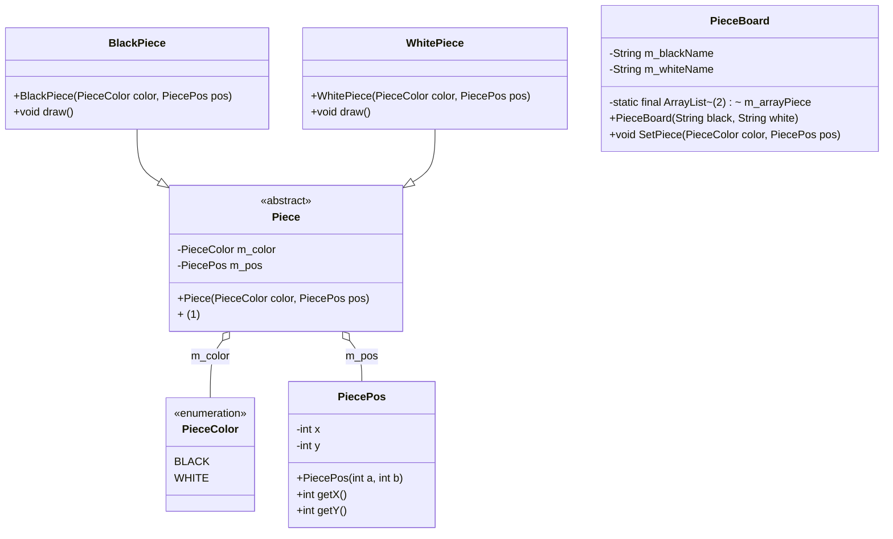
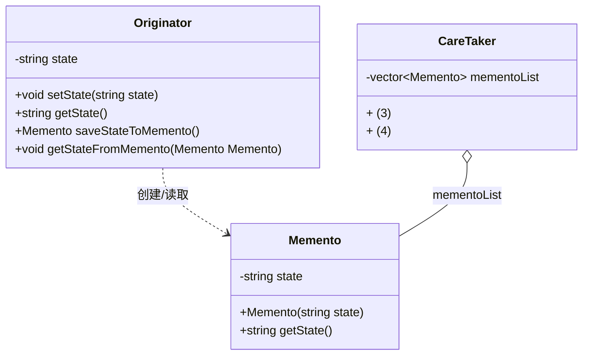

# Day 29 大题专项③：设计模式 + 算法填空 —— 试题练习

> **适用**：软考中级·软件设计师 科目二（下午卷）试题四（C 算法填空，15 分）与
> 试题五/试题六（C++/Java 设计模式填空，15 分，五/六选一）
> **日期**：Day 29｜**上午 3h 做题**｜共 4 道大题（算法填空×2 + 设计模式×2），每题 15 分
> **配套**：答案与丢分点解析见 `patterns-algo-key.md`；识别速查表与答题策略见 `patterns-algo-notes.md`
> **试题来源**：全部为 2020–2023 年下半年/上半年真实下午试卷试题，逐字转录

---

## ⚠️ 使用说明（务必先读）

1. **先做题，后对答案**。本文不含任何答案；做完前不要打开 `patterns-algo-key.md`。
2. **算法题（试题四）说明**：原卷在【说明】末尾给出二维数组 d / cost 的**递归式图片**，
   本地文本源未提取该公式图片。本文对公式给出 **结构化说明**（标注 **【存疑：递归式图形未提取】**），
   只描述"有几项、每项含义"，**不给出任何空的答案**。C 代码骨架全部逐字转录，空 (1)~(n) 一律留空。
3. **设计模式题（试题五/六）说明**：原卷类图为 PDF 图片，本地文本源未收录。本文依据**已完整转录的代码**
   给出 **类结构清单 + 类图骨架**（标注 **【存疑：图形复原】**），只列角色与非空代码里已写明的成员，
   空位一律留空。若手边有原卷 PDF，请对照原图做题。
4. **作答要求**：算法题的空要写出完整 C 语句/表达式（含分号、等号）；设计模式题的空可能是
   一条方法声明、一个类型名或一条语句，按代码上下文补全。计算题（如编辑距离、括号化顺序）
   要写出推导/草表，不要只猜结果。
5. **计时**：试题四建议 35–40 分钟/题，试题五/六建议 30 分钟/题；4 题合计约 2.5–3 小时。
   做完逐题填写计时记录区，再统一对答案。

### 本次选题（替换说明）

| 题号 | 试题来源 | 类型 | 考点 |
|------|----------|------|------|
| 试题 A | 2021 年下半年 下午试题四 | 算法填空（C） | 编辑距离：DP 表边界初始化 + 状态转移 + 递推式 + 策略/复杂度 + 手算实例 |
| 试题 B | 2022 年上半年 下午试题四 | 算法填空（C） | 矩阵连乘：区间 DP 三重循环 + 划分点记录 + 最优解构造 + 复杂度 |
| 试题 C | 2021 年下半年 下午试题六 | 设计模式（Java） | 享元（Flyweight）模式：抽象棋子绘制接口 + 泛型容器元素类型 + 落子逻辑 |
| 试题 D | 2022 年上半年 下午试题五 | 设计模式（C++） | 备忘录（Memento）模式：Originator 存取状态 + Memento 封装 + CareTaker 增查 |

> 【存疑：选题调整】算法第二题原计划选与试题 A **不同算法族**的排序题以覆盖"排序骨架"，但逐一核对后：
> 2020 下试题四（希尔排序）的代码骨架在源文本中与答案位置错位且缺失 `dk` 赋值语句、
> 2021 上试题四（凸多边形三角剖分）代码 OCR 误识较多（循环变量、函数名均误）、
> 2022 下试题四（堆排序）**答案整段缺失**、2023 上试题四**题目与代码均缺失**。
> 出于"题目与答案必须完整且内部自洽"的取舍，改选 **2022 上试题四（矩阵连乘）**——
> 与试题 A 同为动态规划，但模型不同（**序列型** 编辑距离 vs **区间型** 矩阵连乘），
> 恰好覆盖下午卷 DP 题的两大子类型。排序/查找/树遍历/贪心/图遍历等骨架的系统整理
> 见 `patterns-algo-notes.md` 第二章"常考算法骨架清单"。
>
> 【存疑：选题调整】设计模式两题按"不同模式 + 不同语言"选取：**2021 下试题六（Java，享元）**
> 与 **2022 上试题五（C++，备忘录）**，覆盖"对象创建/结构"与"行为/状态恢复"两类，
> 且 Java/C++ 互补，训练两种语言的填空手感。

---

# 试题 A：2021 年下半年 下午试题四（编辑距离）

> **来源**：2021 年下半年 软件设计师 下午试卷 试题四（共 15 分）
> **题型**：C 算法填空（动态规划）｜**建议用时**：35 分钟

## ⏱️ 计时记录（做完后填写）

| 项目 | 记录 |
|------|------|
| 开始时间 | ______ |
| 结束时间 | ______ |
| 实际用时 | ______ 分钟（建议 ≤ 35 分钟） |
| 自评专注度（0-10） | ______ |

---

### 【说明】

生物学上通常采用编辑距离来定义两个物种DNA 序列的相似性，从而刻画物种之间的进化
关系。具体来说，编辑距离是指将一个字符串变换为另一个字符所需要的最小操作次数。操作
有三种，分别为：插入一个字符、删除一个字符以及将一个字符修改为另一个字符。用字符数
组str1 和str2 分别表示长度为len1 和len2 的字符串，定义二维数组d 记录求解编辑距离的
子问题最优解，则该二维数组可以递归定义为：

> 【存疑：原文"变换为另一个字符"，按题意应为"变换为另一个字符串"】
> 【存疑：原文"递归定义为："后接二维数组 d 的递推公式图片，本地文本源未提取该图片。
> 公式结构说明（不含答案）：d[i][j] 表示把 str1 的前 i 个字符变成 str2 的前 j 个字符
> 的最小操作次数；分为**边界**（i=0 或 j=0，即一个串为空时，只能全部插入/删除）与
> **一般位置**（字符相等时直接继承左上角；否则在"删除/插入/替换"三种操作中取最小）两大块。
> 具体表达式请依据下面 C 代码的两个初始化循环与双重循环反推。】

---

### 【C 代码】

下面是算法的C 语言实现。

（1）常量和变量说明

```text
A，B：两个字符数组
d[][]：二维数组
i，j：循环变量
temp：临时变量
```

（2）C 程序

```c
#include <stdio.h>
#define N 100

char A[N] = "CTGA";
char B[N] = "ACGCTA";
int d[N][N];

int min(int a, int b) {
    return a < b ? a : b;
}

int editdistance(char *str1, int len1, char *str2, int len2) {
    int i, j;
    int diff;
    int temp;
    for (i = 0; i <= len1; i ++ ) {
        d[i][0] = i;
    }
    for (j = 0; j <= len2; j ++ ) {
        (1) ;
    }
    for (i = 1; i <= len1; i ++ ) {
        for (j = 1; j <= len2; j ++ ) {
            if ( (2) ) {
                d[i][j] = d[i - 1][j - 1];
            } else {
                temp = min(d[i - 1][j] + 1, d[i][j - 1] + 1);
                d[i][j] = min(temp,   (3)   );
            }
        }
    }
    return   (4)   ;
}
```

> 【存疑：源码声明了变量 `diff` 但代码体中未使用，比较直接写在了空 (2) 中；
> 空号位置与原卷一致，作答时按上下文补全表达式即可。】

---

### 【问题1】（8 分）

根据说明和C 代码，填充C 代码中的空（1）〜（4）。

**答题区**：

- （1）：____________________________________________
- （2）：____________________________________________
- （3）：____________________________________________
- （4）：____________________________________________

> 💡 提示：先看两个初始化循环——第一个循环已给出 `d[i][0] = i;`（行边界），空 (1) 在
> 第二个循环里（列边界），两者结构对称。空 (2) 是"字符是否相等"的判断（注意下标从 1
> 计数时对应字符下标要减 1）。空 (3) 是"替换"操作对应的代价项（与给出的"删除/插入"
> 两项并列取 min）。空 (4) 是整个问题的最终答案所在格子。

---

### 【问题2】（4 分）

根据说明和C 代码，算法采用了  （5）  设计策略，时间复杂度为  （6）  （用O
符合表示，两个字符串的长度分别用m 和n 表示）。

> 【存疑：原文"用O 符合表示"，应为"用O 符号表示"】

**答题区**：

- （5）：____________________________________________
- （6）：____________________________________________

> 💡 提示：判断策略看"用二维数组记录子问题最优解、自底向上填表"这一特征；
> 复杂度看填表的循环嵌套层数与每层规模。

---

### 【问题3】（3 分）

已知两个字符串A="CTGA"和B="ACGCTA"，根据说明和C 代码，可得出这两个
字符串的编辑距离为  （7）  。

**答题区**：

- （7）：____________________________________________

> 💡 提示：在草稿纸上画出 5×7（len1+1 行 × len2+1 列）的 d 表，先填边界（行/列），
> 再按"相等取左上角、否则取 左/上/左上角+1 三者最小"逐格填，右下角即答案。

---
---

# 试题 B：2022 年上半年 下午试题四（矩阵连乘）

> **来源**：2022 年上半年 软件设计师 下午试卷 试题四（共 15 分）
> **题型**：C 算法填空（动态规划）｜**建议用时**：40 分钟

## ⏱️ 计时记录（做完后填写）

| 项目 | 记录 |
|------|------|
| 开始时间 | ______ |
| 结束时间 | ______ |
| 实际用时 | ______ 分钟（建议 ≤ 40 分钟） |
| 自评专注度（0-10） | ______ |

---

### 【说明】

某工程计算中要完成多个矩阵相乘（链乘）的计算任务，对矩阵相乘进行以下说明。

（1）两个矩阵相乘要求第一个矩阵的列数等于第二个矩阵的行数，计算量主要由进行
乘法运算的次数决定。假设采用标准的矩阵相乘算法，计算 A(n*m) * B(m*p)，需要
m*n*p 次乘法运算，即时间复杂度为 O(m*n*p)。

> 【存疑：原文矩阵下标与维数连写（"𝐴𝑛∗𝑚∗𝐵𝑛∗𝑝"），按题意应为
> "A(n*m) * B(m*p)"，即 A 为 n 行 m 列、B 为 m 行 p 列】

（2）矩阵相乘满足结合律，多个矩阵相乘时不同的计算顺序会产生不同的计算量。以
矩阵 A1 为 5*100、A2 为 100*8、A3 为 8*50 三个矩阵相乘为例，若按
(A1 * A2) * A3 计算，则需要进行 5*100*8 + 5*8*50 = 6000 次乘法运算，若按
A1 * (A2 * A3) 计算，则需要进行 100*8*50 + 5*100*50 = 65000 次乘法运算。

> 【存疑：原文"矩阵𝐴15∗100，𝐴2100∗8，𝐴38∗50"，矩阵下标与维数连写，
> 此处按题意与算例还原为"A1 为 5*100、A2 为 100*8、A3 为 8*50"】

矩阵连乘问题可描述为：给定 n 个矩阵，对较大的 n，可能计算的顺序数量非常庞大，用
蛮力法确定计算顺序是不实际的。经过对问题进行分析，发现矩阵连乘问题具有最优子结构，
即若 A1 * A2 *…* An 的一个最优计算顺序从第 k 个矩阵处断开，即分为
A1 * A2 *…* Ak 和 A(k+1) * A(k+2) *…* An 两个子问题，则该最优解应该包含
A1 * A2 *…* Ak 的一个最优计算顺序和 A(k+1) * A(k+2) *…* An 的一个最优计算顺序。
据此构造递归式：

> 【存疑：原文"据此构造递归式："后接 cost 的递推公式图片，本地文本源未提取该图片。
> 公式结构说明（不含答案）：cost[i][j] 表示连乘 A(i+1) *…* A(j+1) 的最优代价；
> 分为**对角线**（i=j，单个矩阵，代价 0）与**一般位置**（枚举断点 k，
> cost = 左段代价 + 右段代价 + 两段相乘的乘法次数）两大块。具体表达式请依据
> 下面 C 代码的三重循环与变量说明反推。】

其中，cost[i][j] 表示 A(i+1) * A(i+2) *…* A(j+1) 的最优计算的代价。最终需要
求解 cost[0][n – 1]。

---

### 【C 代码】

算法实现采用自底向上的计算过程。首先计算两个矩阵相乘的计算量，然后依次计算3 个矩阵、
4 个矩阵、…、n 个矩阵相乘的最小计算量及最优计算顺序。下面是算法的C 语言实现。

（1）主要变量说明

```text
n：矩阵数
seq[]：矩阵维数序列
cost[][]：二维数组，长度为 n*n，其中元素 cost[i][j] 表示 A(i+1) *…* A(j+1)
          的最优计算的计算代价
trace[][]：二维数组，长度为 n*n，其中元素 trace[i][j] 表示 A(i+1) *…* A(j+1)
           的最优计算对应的划分位置，即 k
```

> 【存疑：原文"n：矩阵数、"句末多一个逗号；维数序列长度应为 n+1
> （n 个矩阵各有 1 个行维数、末矩阵 1 个列维数），此处按原文转录】

（2）函数 cmm

```c
#define N 100
int cost[N][N];
int trace[N][N];
int cmm(int n, int seq[]) {
    int tempCost;
    int tempTrace;
    int i, j, k, p;
    int temp;
    for (i = 0; i < n; i ++ ) { cost[i][i] = 0; }
    for (p = 1; p < n; p ++ ) {
        for (i = 0; i < n - p; i ++ ) {
            (1) ;
            tempCost = -1;
            for (k = i;   (2)   ; k ++ ) {
                temp =   (3)   ;
                if (tempCost == -1 || tempCost > temp) {
                    tempCost = temp;
                    tempTrace = k;
                }
            }
            cost[i][j] = tempCost;
            (4) ;
        }
    }
    return cost[0][n - 1];
}
```

---

### 【问题1】（8 分）

根据以上说明和C 代码，填充C 代码中的空（1）〜（4）。

**答题区**：

- （1）：____________________________________________
- （2）：____________________________________________
- （3）：____________________________________________
- （4）：____________________________________________

> 💡 提示：外层 `p` 是**子问题规模**（矩阵个数），`i` 是起点，空 (1) 应由 i 与 p
> 推出终点 j。空 (2) 是断点 k 的枚举上界（断点把 [i..j] 分成左右两段）。
> 空 (3) 是"左段代价 + 右段代价 + 两段合并的乘法次数"，维数全部从 `seq[]` 取，
> 注意下标偏移（k 是断点矩阵编号，左段末矩阵与右段首矩阵的维数各是哪一个）。
> 空 (4) 把找到的最优断点记进 trace 数组（与 cost[i][j] 赋值对称）。

---

### 【问题2】（4 分）

根据以上说明和C 代码，该问题采用了  （5）  算法设计策略，时间复杂度为  （6）  。
（用O 符号表示）

**答题区**：

- （5）：____________________________________________
- （6）：____________________________________________

> 💡 提示：策略判断同试题 A（自底向上填表 + 最优子结构）；复杂度看三重循环
> （规模 p、起点 i、断点 k）每层最多跑多少次。

---

### 【问题3】（3 分）

考虑实例n = 4，各个矩阵的维数：A1 为15 * 5，A2 为5 * 10，A3 为10 * 20，
A4 为20 * 25，即维数序列为15, 5, 10, 20, 25。则根据上述C 代码得到的一个最优
计算顺序为  （7）  （用加括号方式表示计算顺序），所需要的乘法运算次数为  （8）  。

**答题区**：

- （7）：____________________________________________
- （8）：____________________________________________

> 💡 提示：列出全部 5 种括号化方式，用说明 (1) 的公式逐种算乘法次数取最小：
> `A1*((A2*A3)*A4)`、`A1*(A2*(A3*A4))`、`((A1*A2)*A3)*A4`、
> `(A1*A2)*(A3*A4)`、`(A1*(A2*A3))*A4`（后两种与第一种同类，按对结合律展开即可）。

---
---

# 试题 C：2021 年下半年 下午试题六（网络围棋 —— 享元模式，Java）

> **来源**：2021 年下半年 软件设计师 下午试卷 试题六（共 15 分）
> **题型**：Java 设计模式填空（享元 Flyweight）｜**建议用时**：30 分钟
> **说明**：试题五/六为选答题，本题以 Java 实现，可与试题 D（C++）互相印证。

## ⏱️ 计时记录（做完后填写）

| 项目 | 记录 |
|------|------|
| 开始时间 | ______ |
| 结束时间 | ______ |
| 实际用时 | ______ 分钟（建议 ≤ 30 分钟） |
| 自评专注度（0-10） | ______ |

---

### 【说明】

享元（FlyWeight）模式主要用于减少创建对象的数量，以降低内存占用，提高性能。
先要开发一个网络围棋程序，允许多个玩家联机下棋。由于只有一台服务器，为节省内存
空间，采用享元模式实现该程序，得到如图6-1 所示的类图。

> 【存疑：原文"先要开发"，按题意应为"现要开发"】

---

### 类图结构化复原【存疑：图形复原】

> ⚠️ 原卷图 6-1 为 PDF 图片，本地文本源未收录。以下骨架依据**已完整转录的 Java 代码**
> 复原（角色、成员均取自代码本身，非猜测），**空位一律留空**。

**模式角色 → 本题类的映射**：

| 享元模式角色 | 本题对应 | 说明 |
|--------------|----------|------|
| 抽象享元（Flyweight） | `Piece`（抽象类） | 定义棋子的公共状态与抽象操作 |
| 具体享元（ConcreteFlyweight） | `BlackPiece`、`WhitePiece` | 黑子/白子，实现抽象操作 |
| 享元工厂（FlyweightFactory） | （本题由 `PieceBoard` 承担获取/管理棋子的职责） | 创建/管理棋子对象 |
| 非享元（UnsharedFlyweight） | `PiecePos`（棋子位置） | 每次落子都不同，不共享 |
| 客户端（Client） | `PieceBoard` 的 `SetPiece` | 落子时获取棋子并记录位置 |

**类结构清单**（成员取自代码，空位以 `(n)` 标出）：



> 💡 **读图提示**：`Piece` 是抽象享元，两个具体子类各自实现了 `draw()`；
> `PiecePos` 是位置（外部状态），与颜色（内部状态）分离——这正是享元模式的代码特征。
> 空 (1) 在抽象类 `Piece` 中、且两个子类都已实现 `draw()`，据此可推出 (1) 的声明形式。
> 空 (2) 是棋盘容器元素的类型名（看后面 `m_arrayPiece.add(piece)` 时 `piece` 是什么类型）。

---

### 【Java 代码】

```java
import java.util.*;

enum PieceColor { BLACK, WHITE } // 棋子颜色

class PiecePos { // 棋子位置
    private int x;
    private int y;
    public PiecePos(int a, int b) { x = a; y = b; }
    public int getX() { return x; }
    public int getY() { return y; }
}

abstract class Piece { // 棋子定义
    protected PieceColor m_color; // 颜色
    protected PiecePos m_pos; // 位置
    public Piece(PieceColor color, PiecePos pos) {
        m_color = color;
        m_pos = pos;
    }
    (1) ;
}

class BlackPiece extends Piece {
    public BlackPiece(PieceColor color, PiecePos pos) {
        super(color, pos);
    }
    public void draw() { System.out.println("draw a blackpiece"); }
}

class WhitePiece extends Piece {
    public WhitePiece(PieceColor color, PiecePos pos) {
        super(color, pos);
    }
    public void draw() { System.out.println("white a blackpiece"); }
}
```

> 【存疑：原文 `WhitePiece.draw()` 输出 "white a blackpiece"，按题意应为
> "draw a white piece"，系原卷/源文本笔误，**不影响填空**（(1) 的形式由两个子类的
> `public void draw()` 签名决定）】

```java
class PieceBoard { // 棋盘上已有的棋子
    private static final ArrayList<(2)> m_arrayPiece = new ArrayList
    private String m_blackName; // 黑方名称
    private String m_whiteName; // 白方名称
    public PieceBoard(String black, String white) {
        m_blackName = black;
        m_whiteName = white;
    }

    // 一步棋，在棋盘上放一颗棋子
    public void SetPiece(PieceColor color, PiecePos pos) {
        (3)  piece = null;
        if (color == PieceColor.BLACK) { // 放黑子
            piece = new BlackPiece(color, pos); // 获取一颗黑子
            System.out.println(m_blackName + "在位置(" + pos.getX() + ","
                    + pos.getY() + ")");
            (4) ;
        } else { // 放白子
            piece = new WhitePiece(color, pos); // 获取一颗白子
            System.out.println(m_whiteName + "在位置(" + pos.getX() + ","
                    + pos.getY() + ")");
            (5) ;
        }
        m_arrayPiece.add(piece);
    }
}
```

> 【存疑：原文 `new ArrayList` 后无泛型实参（源文本截断），按 Java 语法应补上
> `new ArrayList<…>()`（泛型实参即空 (2) 要填的类型名），作答时 (2) 填类型名即可】

---

### 【作答要求】

> 阅读下列说明和Java 代码，将应填入  （n）  处的字句写在答题纸的对应栏内。

**答题区**：

- （1）：____________________________________________
- （2）：____________________________________________
- （3）：____________________________________________
- （4）：____________________________________________
- （5）：____________________________________________

> 💡 提示：
> - (1)：抽象享元里声明的抽象方法，两个子类都已实现它（看子类方法签名）；
> - (2)：集合元素类型，看 `add(piece)` 时 `piece` 的声明类型（即空 (3)）；
> - (3)：局部变量类型，须能同时指向 `BlackPiece` 和 `WhitePiece`；
> - (4)(5)：落子后调用棋子的绘制方法（两个分支结构对称）。

---
---

# 试题 D：2022 年上半年 下午试题五（状态撤销 —— 备忘录模式，C++）

> **来源**：2022 年上半年 软件设计师 下午试卷 试题五（共 15 分）
> **题型**：C++ 设计模式填空（备忘录 Memento）｜**建议用时**：30 分钟
> **说明**：试题五/六为选答题，本题以 C++ 实现，可与试题 C（Java）互相印证。

## ⏱️ 计时记录（做完后填写）

| 项目 | 记录 |
|------|------|
| 开始时间 | ______ |
| 结束时间 | ______ |
| 实际用时 | ______ 分钟（建议 ≤ 30 分钟） |
| 自评专注度（0-10） | ______ |

---

### 【说明】

在软件系统中，通常都会给用户提供取消、不确定或者错误的操作，允许将系统回复到
原先的状态。现使用备忘录（Memento）模式实现该要求，得到如图5-1 所示的类图。

Memento 包含了要被恢复的状态。Originator 创建并在Memento 中存储状态。
CareTaker 负责从Memento 中恢复状态。

> 【存疑：原文"将系统回复到原先的状态"，按题意应为"恢复到原先的状态"】

---

### 类图结构化复原【存疑：图形复原】

> ⚠️ 原卷图 5-1 为 PDF 图片，本地文本源未收录。以下骨架依据**已完整转录的 C++ 代码**
> 复原（角色、成员均取自代码本身，非猜测），**空位一律留空**。

**模式角色 → 本题类的映射**：

| 备忘录模式角色 | 本题对应 | 说明 |
|----------------|----------|------|
| 发起人（Originator） | `Originator` | 持有当前状态，能存入/取出备忘录 |
| 备忘录（Memento） | `Memento` | 封装发起人的内部状态 |
| 管理者（Caretaker） | `CareTaker` | 保存备忘录列表，按索引存取 |

**类结构清单**（成员取自代码，空位以 `(n)` 标出）：



> 💡 **读图提示**：`Memento` 封装 `state`（只能通过构造传入、getState 取出）；
> `Originator` 的 `saveStateToMemento()` 返回一个备忘录（空 (1)：怎么构造），
> `getStateFromMemento(...)` 从备忘录恢复（空 (2)：怎么取值）；
> `CareTaker` 有两个方法（空 (3)(4) 是方法声明，方法体里用到了 `state`、`index`
> 和 `mementoList.push_back/get`，方法名由 `main` 中的 `careTaker->add(...)`、
> `careTaker->get(...)` 调用确定）。

---

### 【C++代码】

```cpp
#include <iostream>
#include <string>
#include <vector>

using namespace std;

class Memento {
private:
    string state;

public:
    Memento(string state) { this->state = state; }
    string getState() { return state; }
};

class Originator {
private:
    string state;

public:
    void setState(string state) { this->state = state; }
    string getState() { return state; }
    Memento saveStateToMemento() { return   (1)  ; }
    void getStateFromMemento(Memento Memento) { state =   (2)  ; }
};

class CareTaker {
private:
    vector<Memento> mementoList;
public:
    void   (3)   { mementoList.push_back(state); }
      (4)   { return mementoList[index]; }
};
```

> 【存疑：原文形参名与类名同名（`Memento Memento`），空 (2) 的答案指向该形参
> （即"用形参 Memento 调用 getState()"）；按原卷转录，不作改名】

```cpp
int main() {
    Originator *originator = new Originator();
    CareTaker *careTaker = new CareTaker();
    originator->setState("State #1");
    originator->setState("State #2");
    careTaker->add(  (5)  );
    originator->setState("State #3");
    careTaker->add(  (6)  );
    originator->setState("State #4");

    cout << "Current State：" + originator->getState() << endl;
    originator->getStateFromMemento(careTaker->get(0));
    cout << "First saved State：" + originator->getState() << endl;
    originator->getStateFromMemento(careTaker->get(1));
    cout << "Second saved State：" + originator->getState() << endl;
}
```

> 💡 **运行逻辑提示（对照 main 理解三个角色如何协作）**：
> `setState("State #2")` → `add(...)` 把当时状态存为第 0 个备忘录；
> `setState("State #3")` → `add(...)` 存为第 1 个备忘录；
> 之后 `setState("State #4")`；`get(0)/get(1)` 再取回 → 输出应显示
> "State #4"→"State #2"→"State #3"。空 (5)(6) 即"发起人把当前状态打包成备忘录"
> 的方法调用。

---

### 【作答要求】

> 阅读下列说明和C++代码，将应填入  （n）  处的字句写在答题纸的对应栏内。

**答题区**：

- （1）：____________________________________________
- （2）：____________________________________________
- （3）：____________________________________________
- （4）：____________________________________________
- （5）：____________________________________________
- （6）：____________________________________________

> 💡 提示：
> - (1)：构造一个 Memento 对象返回（用发起人的当前状态）；
> - (2)：从形参（备忘录）取状态赋给 this->state；
> - (3)：方法声明空。方法名由 `main` 中的 `careTaker->add(...)` 调用确定，
>   形参名/类型由方法体里的 `mementoList.push_back(state)` 确定（无返回值）；
> - (4)：方法声明空。返回类型由方法体 `return mementoList[index];` 的结果类型确定，
>   方法名由 `careTaker->get(0)` 调用确定，形参与方法体的下标变量同名；
> - (5)(6)：发起人保存状态的方法调用（两个空写法相同）。

---
---

## 📊 做完后：自评与对答案

1. 填写各题计时记录区，计算 4 题总用时：______ 分钟（目标 ≤ 150 分钟）
2. 打开 `patterns-algo-key.md`，逐题对答案，每题计算得分 /15。
3. 在下表登记，并把丢分点回填到 `patterns-algo-notes.md` 的高频丢分点清单：

| 题号 | 试题 | 得分 | 主要丢分点 | 是否回看模板 |
|------|------|------|------------|--------------|
| A | 2021下·试题四 算法 编辑距离（DP） | ____ / 15 | ________________ | ☐ |
| B | 2022上·试题四 算法 矩阵连乘（DP） | ____ / 15 | ________________ | ☐ |
| C | 2021下·试题六 Java 享元模式 | ____ / 15 | ________________ | ☐ |
| D | 2022上·试题五 C++ 备忘录模式 | ____ / 15 | ________________ | ☐ |
| **合计** | | ____ / 60 | | |

> **合格线参考**：下午卷 4 题必答 + 1 题选答，每题 15 分，合格 45 分。
> 试题四（算法）与试题五/六（设计模式）是**选答策略的核心**：
> 若设计模式题能稳定拿到 **10 分以上**，建议选答五/六；若 DP 填空更熟，则试题四更稳。
> 本专项 4 题若能稳定拿到 **10 分/题以上**，即视为过关。
